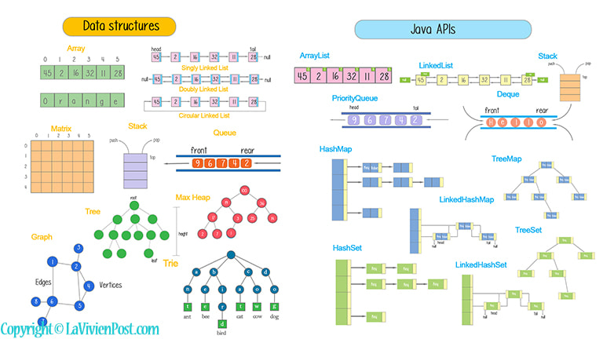

# Data Structures

Data Structures is a series of packages written in Java and C++ for organizing 
data structures as abstract classes and their implemented subclasses.

)

## Usage for Leetcode

Find the exercise you're interested in, and follow the compiling directions as 
listed within the given .cpp file. For instance...

### Two Sum Example

To test:

1. Navigate to the directory where you saved your .cpp file: 
You can use the cd (change directory) command to navigate to 
the directory where your file is located.

    $ cd path/to/your/cpp/file

2. Compile the code: Use the g++ (GNU C++ compiler) command to compile your code. 
Replace twosum.cpp with the actual name of your source code file if it's different.

    $ g++ -std=c++11 -o two_sum two_sum.cpp

        This command tells the compiler to create an 
        executable file named twosum from your twosum.cpp source file.

3. Run the executable: After successful compilation, 
you can run your program by executing the generated executable.

    On Windows: $ two_sum.exe
    On Linux: $ ./two_sum
    On Mac: $ ./two_sum

## Installation of Templates / Abstract Classes

Import the packages in (abstract_classes). From there, you can modify and 
implement any data structure as needed quickly for backend development projects. 

## Usage for Abstract Classes

Import the desired abstract class and concrete subclass of the data structure 
needed. Then, modify the structure to implement the program as desired in 
your own program.

## Contributing

Pull requests are welcome. For major changes, please open an issue first
to discuss what you would like to change.

## Academic Learning - Thanks Given to Professor Daniel Bauer

[[Columbia](http://www.cs.columbia.edu/~bauer/cs3134-f15/index.html)]

## Mentorship - Thank You to Sedona Thomas for Your Mentorship

[[Sedona Thomas](http://www.columbia.edu/~snt2127/)]

This code is inspired by concepts from CS3134 but does not complete any 
assignment structure on its own from this course.

Do Leetcode! It'll help! It takes a lot of time.
